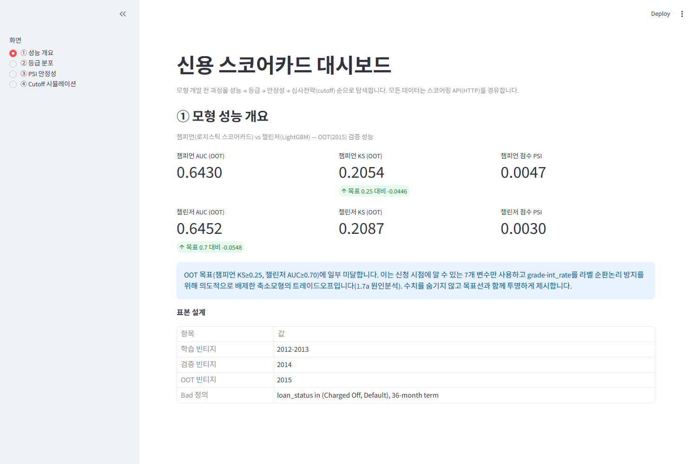
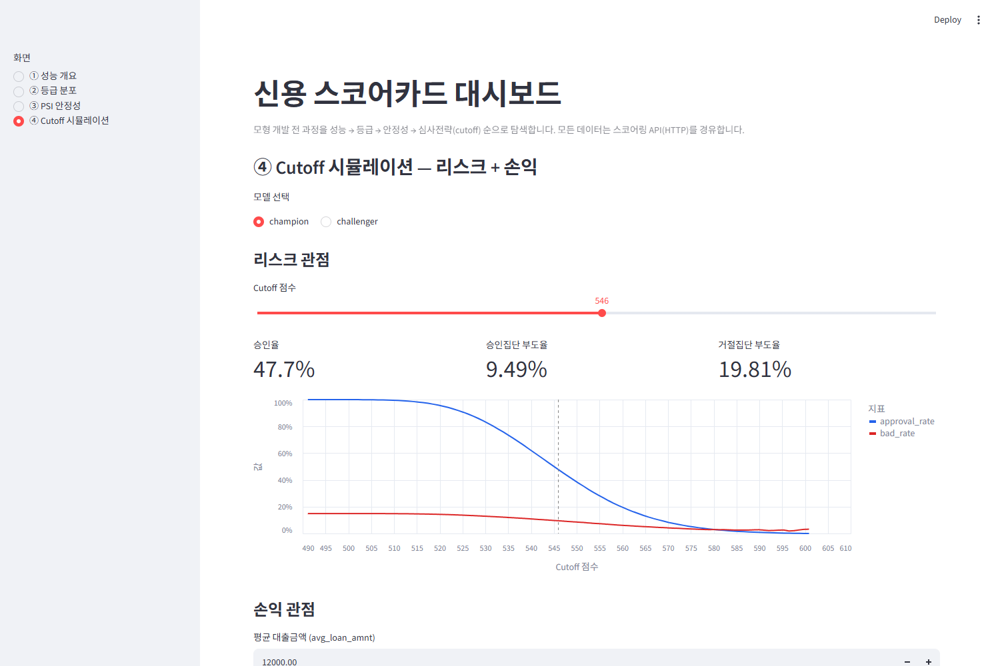

# credit-scorecard-lab

**Lending Club 실데이터 58.9만 건으로 신용평가 스코어카드를 개발하고, 점수를 심사 전략으로 번역한 포트폴리오 프로젝트.**
모형 개발(WOE 스코어카드 + LightGBM) → FastAPI 서빙 → Streamlit 대시보드까지 end-to-end로 동작하며,
"모델러"가 아니라 **심사 전략을 제안하는 컨설턴트** 관점의 산출물(손익 cutoff·룰 진단)에 무게를 둡니다.

## 핵심 수치 한눈에

| 항목 | 결과 |
|---|---|
| 데이터 | Lending Club accepted **589,635건** (2012–15 빈티지, 36개월물) · train 2012–13 / valid 2014 / **OOT 2015** |
| 변수 | 17 후보 → **7개** (IV 필터 + 상관 제거). `grade`·`int_rate`는 라벨 순환논리로 **의도적 배제** |
| 챔피언 (WOE 스코어카드) | OOT **AUC 0.6430 / KS 0.2054** (목표 KS≥0.25 **미달** — 원인은 아래) |
| 챌린저 (LightGBM+보정) | OOT **AUC 0.6452 / KS 0.2087** (목표 AUC≥0.70 **미달**) |
| 등급 | 10등급 **자연 단조**, 부도율 **4.07% → 23.57%** |
| 안정성 (PSI) | 챔피언 **0.0047** / 챌린저 **0.0030** (valid→OOT, 목표 <0.1 ✅) |
| 서빙 | FastAPI **8 엔드포인트**, `/v1/score` p95 **33.6ms** (목표 <300ms ✅) |
| 테스트 | **221 passed** |

> **성능 목표 미달을 숨기지 않습니다.** train/valid/OOT 성능차가 거의 없어(0.6468/0.6406/0.6430) **과적합은 없으며**,
> 신청시점 7변수만 쓰고 `grade`·`int_rate`(= Lending Club 자체 심사 결과)를 배제한 **방법론적 선택의 트레이드오프**입니다.
> 숫자를 위해 순환논리를 허용하지 않았습니다. → [원인 분석](docs/MDD.md#5-성능-평가-3면--목표-미달과-그-원인)

## 이 프로젝트의 발견 3가지

**1. 손익 최적 cutoff은 리스크 cutoff보다 훨씬 낮다** — 챔피언 기준 **546.01 → 494.43**, 승인율 **+52.29pp**, 연간 기대손익 **+₩131.8M**.
이자수익이 부도손실을 상쇄하는 구간이 리스크 관점의 거절 영역까지 뻗어 있습니다. **CX와 수익이 대립하지 않는다**는 정량적 근거.
→ [경영진 1페이저](docs/implementation-artifacts/profit-cutoff-onepager-2-4.md)

**2. 스코어카드가 있으면 하드룰의 상당수는 중복이거나 비효율이다** — 가상 룰 3종 진단 결과 **전부 재검토 권장**.
DTI·조회 룰은 배제집단의 **85~94%를 모형이 이미 거절**(중복), 연체 룰은 모집단의 21%를 거절하면서 판별력 **1.07배**(기회손실 **₩9,441만**).
→ [룰 정비 제안](docs/implementation-artifacts/rule-efficiency-report-3-1.md)

**3. 비금융 텍스트(직함)는 이 데이터에서 효과가 없었다** — `emp_title` 파생변수 IV **0.0116**(임계 0.02 미달, 전 정형변수보다 낮음).
**효과 없음을 검증한 것 자체가 산출물**입니다 — 근거 없이 피처를 늘리지 않았다는 판단.
→ [검증 리포트](docs/implementation-artifacts/text-features-report-3-2.md)

## 대시보드 (Streamlit, 4화면)

성능 → 등급분포 → PSI → cutoff 시뮬레이션 순으로 "모형 신뢰 구축 후 전략 제안"의 5분 데모 동선.
모든 데이터는 **HTTP API 경유만**(아키텍처 AD-9).

| 성능 개요 | Cutoff 시뮬레이션 (리스크 + 손익) |
|---|---|
|  |  |

[등급 분포](docs/implementation-artifacts/dashboard-screenshots-2-5/02-grades.png) · [PSI 안정성](docs/implementation-artifacts/dashboard-screenshots-2-5/03-psi.png)

## 빠른 실행

```powershell
# 환경 + 데이터 (데이터·아티팩트는 gitignore — 스크립트로 재생성)
python -m venv .venv
.venv\Scripts\python.exe -m pip install -r requirements.txt
.venv\Scripts\python.exe pipelines\01_download.py

# 서빙 + 대시보드 (2개 프로세스)
.venv\Scripts\python.exe -m uvicorn app.main:app --port 8000
.venv\Scripts\python.exe -m streamlit run dashboard\app.py
```

## 아키텍처

```
data/ (raw parquet)
  └─ pipelines/ + scorecard/   오프라인 파이프라인 → frozen 아티팩트 + scored validation frame (불변)
       └─ app/ (FastAPI)        읽기 전용 소비 · 점수/PD/등급/사유/시뮬레이션 (판정은 안 함)
            └─ dashboard/       HTTP API 경유만 (AD-9)
```

- **AD-3**: 검증 프레임은 불변 — 소비자는 재계산하지 않는다.
- **AD-5**: `API_SPEC.md`가 응답 계약의 단일 진실. 구현이 계약을 바꾸면 스펙을 먼저 고친다.
- **AD-7**: 판정(최적 cutoff·룰 verdict)은 **순수 규칙·산술** — LLM 호출 없음.
- **AD-9**: 대시보드는 아티팩트를 직접 읽지 않는다.

## 컨설턴트 킥 4종

| # | 내용 | 산출물 |
|---|---|---|
| ① | **손익 기반 cutoff** — 리스크가 아닌 실현손익으로 cutoff 평가 | [1페이저](docs/implementation-artifacts/profit-cutoff-onepager-2-4.md) · `POST /v1/simulate/profit-cutoff` |
| ② | **룰 효율성 진단** — 하드룰이 모형 대비 값을 하는지 규칙 기반 판정 | [리포트](docs/implementation-artifacts/rule-efficiency-report-3-1.md) · `GET /v1/rules/efficiency` |
| ③ | **비금융 텍스트 검증** — emp_title 파생변수 IV 측정(네거티브 결과) | [리포트](docs/implementation-artifacts/text-features-report-3-2.md) |
| ④ | **SAS 이식** — 점수 산출 로직을 SAS로 이식·대조 (미러 오차 **4.74e-07**, 기준 0.5) | [대조 리포트](docs/implementation-artifacts/sas-replication-report-3-3.md) · [`sas/scorecard_scoring.sas`](sas/scorecard_scoring.sas) |

## 문서

- **[docs/MDD.md](docs/MDD.md)** — 모형 개발 문서: 표본설계 근거 · 성능 해석 · **reject inference를 포함한 한계** · CX/DX 함의
- [API_SPEC.md](API_SPEC.md) — 8 엔드포인트 응답 계약
- [docs/implementation-artifacts/](docs/implementation-artifacts/) — 스토리별 상세 리포트 12종 + [의도적으로 미룬 항목](docs/implementation-artifacts/deferred-work.md)
- [docs/specs/](docs/specs/) · [docs/planning-artifacts/](docs/planning-artifacts/) — SPEC(CAP-1~17) · 아키텍처 스파인(AD-1~9) · 에픽

## 테스트

```powershell
$env:PYTHONIOENCODING="utf-8"; .venv\Scripts\python.exe -m pytest -q
```

## 데이터 확보 상세

`pipelines/01_download.py`가 kagglehub로 원본(~1.6GB CSV)을 받아 usecols+dtype 지정 로드로 메모리 안전하게 읽고,
**2012~2015 빈티지 · 36개월물**만 `data/lc_accepted_2012_2015_36m.parquet`로 저장합니다 (NFR5: 데이터는 커밋하지 않음).

kagglehub 익명 접근이 막힌 환경이라면: ① Kaggle CLI(`kaggle datasets download -d wordsforthewise/lending-club`)
② [수동 다운로드](https://www.kaggle.com/datasets/wordsforthewise/lending-club) 후
`.venv\Scripts\python.exe pipelines\01_download.py --csv <path-to-csv.gz>`.
