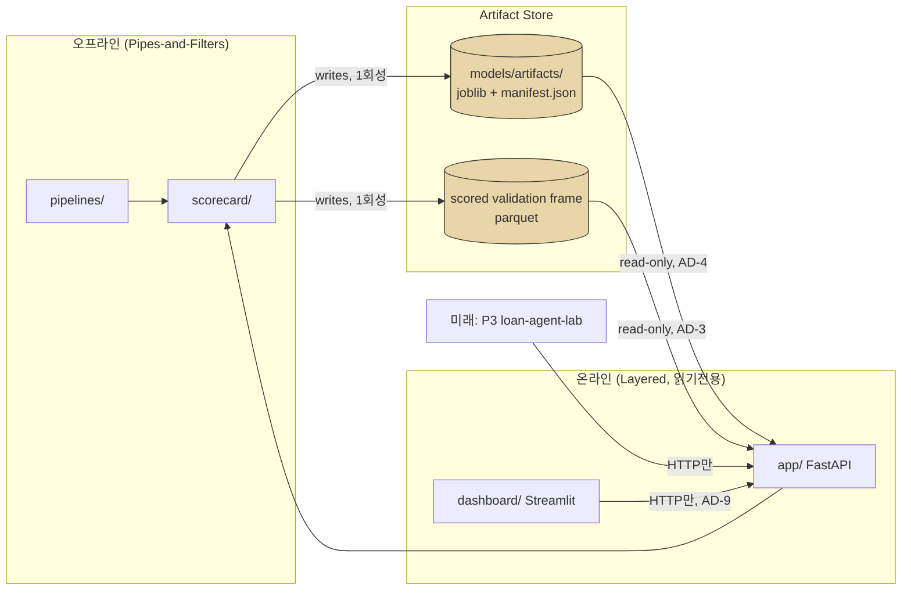

# Architecture Spine — credit-scorecard-lab

## Design Paradigm

**Pipes-and-Filters 오프라인 파이프라인 + Layered 읽기전용 서빙.** 모형 개발(CAP-1~11, 14~17)은 순차 필터 체인으로 흘러 단 하나의 산출물 — 버저닝된 아티팩트 번들 — 을 남긴다. 서빙(CAP-12, 13)은 그 번들을 읽기만 하는 얇은 레이어로, 학습·재계산을 절대 수행하지 않는다. 두 세계는 아티팩트 번들이라는 단일 계약으로만 통신한다(AD-1).

| 레이어 | 디렉토리 | 의존 방향 |
| --- | --- | --- |
| Filters (오프라인 파이프라인) | `pipelines/`, `scorecard/` | `scorecard/`에만 의존, 서로 순차 실행 |
| Artifact Store | `models/artifacts/` | 파이프라인이 쓰고, 서빙이 읽음(단방향) |
| Serving Layer | `app/` | `scorecard/`에 의존 가능, 역방향 금지 |
| Presentation | `dashboard/` | `app/`의 HTTP API에만 의존, 아티팩트 직접 접근 금지 |

## Invariants & Rules

### AD-1 — Model Artifact Contract

- **Binds:** CAP-4, CAP-5, CAP-6, CAP-7, CAP-9, CAP-10, CAP-11, CAP-14, CAP-15
- **Prevents:** 파이프라인 작성자와 서빙 작성자가 각자 다른 직렬화 포맷·피처 순서·스케일링을 골라 서빙 시점에 훈련 시점과 어긋나는 것
- **Rule:** 파이프라인과 API 사이의 유일한 통로는 버저닝된 아티팩트 번들이다 — `joblib` 모델 파일 + `manifest.json`. manifest.json은 모델 유형과 무관하게 공통 키 `model_type`(champion|challenger), `model_version`, `trained_at`, `feature_order`(list), `grade_thresholds`(등급→점수구간, CAP-7이 쓰고 CAP-9·CAP-14가 읽는 유일한 소스)를 반드시 포함하고, 챔피언은 `pdo`·`base_score`·`woe_bin_edges`를, 챌린저는 `calibration_method`·`shap_background_sample_ref`(SHAP 배경표본을 가리키는 고정 참조 — 요청마다 재계산 금지)를 추가로 포함한다. 다른 데이터 경로(직접 DB 조회, 별도 캐시 등)는 허용하지 않는다.

### AD-2 — Train/Serve Parity

- **Binds:** CAP-3, CAP-4, CAP-11, CAP-12
- **Prevents:** 훈련 시 쓰인 WOE 변환 로직과 서빙 시 쓰이는 변환 로직이 별도 구현으로 갈라지는 훈련/서빙 스큐
- **Rule:** WOE 변환 로직은 `scorecard/binning.py` 단일 모듈에만 존재한다. 파이프라인 스크립트와 `app/loader.py` 둘 다 이 모듈을 import해서 쓴다. `app/` 내부에 비닝 로직을 재구현하는 것을 금지한다.

### AD-3 — Canonical Scored Validation Frame

- **Binds:** CAP-9, CAP-10, CAP-13, CAP-14, CAP-15
- **Prevents:** cutoff 곡선·swap-set·손익 시뮬레이션·룰 진단·대시보드가 각자 다른 검증 표본 스냅샷을 써서 같은 지표에 대해 서로 다른 숫자를 보여주는 것
- **Rule:** 평가 단계(CAP-6, CAP-8)가 1회 생성하는 scored validation/OOT parquet이 이 5개 캡의 유일한 데이터 소스다. 컬럼 스키마를 고정한다: `applicant_id, vintage, model_type, score, pd, grade, bad_flag, int_rate, recoveries, total_pymnt`. 이 이름·타입 밖의 별칭(`is_bad` 등)을 어느 캡도 임의로 쓰지 않는다. 어느 캡도 독립적으로 예측을 재계산하지 않는다.

### AD-4 — Read-only Serving

- **Binds:** CAP-12, 전체 `app/`
- **Prevents:** API가 요청 처리 중 우발적으로 아티팩트를 갱신하거나 온라인 학습을 수행해 재현성이 깨지는 것
- **Rule:** `app/`은 학습·재학습·아티팩트 변경을 절대 수행하지 않는다. 프로세스 시작 시 frozen 아티팩트 번들과 scored validation frame을 로드만 한다.

### AD-5 — Response Contract [ADOPTED]

- **Binds:** CAP-12
- **Prevents:** 구현이 API_SPEC.md의 스키마와 조용히 어긋나는 것(필드 누락·타입 변경)
- **Rule:** `API_SPEC.md`(SPEC의 adopted companion)의 스키마가 구속력을 가진다. 필드 변경은 API_SPEC.md를 먼저 수정한 뒤 구현한다. `/v1` 내에서는 추가만 허용하고, 파괴적 변경은 `/v2`로 간다.

### AD-6 — Reason Code Shape Parity [ADOPTED]

- **Binds:** CAP-11
- **Prevents:** 챔피언·챌린저 reason code 구현이 서로 다른 응답 구조를 반환해 API 소비자가 모델 유형별로 분기 처리를 해야 하는 것
- **Rule:** 챔피언·챌린저 reason_codes는 동일한 rank/description 구조를 공유하는 pydantic 베이스 모델을 상속하고, 값 필드만 다르다(`points_lost` vs `shap_value`).

### AD-7 — Deterministic Rule-based Verdicts [ADOPTED]

- **Binds:** CAP-14, CAP-15
- **Prevents:** 손익·룰 진단의 verdict 산출이 LLM 호출로 흘러들어가 비결정적이 되거나 P3의 "결정은 룰과 모형" 원칙과 충돌하는 것
- **Rule:** `profit.py`, `rule_efficiency.py`의 판정 로직은 순수 규칙·통계 함수로만 구현한다. LLM이나 외부 API 호출을 금지한다.

### AD-8 — Deployment Envelope

- **Binds:** 전체 시스템
- **Prevents:** 배포 환경·인프라 결정이 암묵적으로 표류해(예: 누군가 DB를 끌어오거나 컨테이너화를 시작) 스코프가 조용히 확장되는 것
- **Rule:** 로컬 단일 환경(dev only)으로 한정한다. `uvicorn`(app)과 `streamlit`(dashboard)을 로컬 프로세스로 구동하고, DB 없이 parquet/파일 기반으로 동작한다. 아티팩트는 `models/artifacts/`(gitignore) 로컬 디스크에 저장한다. 컨테이너화·클라우드 배포·CI는 이번 스코프 밖 — P3(loan-agent-lab) 연동이 라이브로 필요해지는 시점에 재검토한다.

### AD-9 — Dependency Direction

- **Binds:** 전체 디렉토리 구조
- **Prevents:** 대시보드가 API를 우회해 아티팩트 파일을 직접 읽어, API 응답과 다른 숫자를 보여주는 것
- **Rule:** `app/`은 `scorecard/`에 의존할 수 있으나 역방향은 금지. `pipelines/`는 `scorecard/`에 의존한다. `dashboard/`는 반드시 `app/`의 HTTP API를 통해서만 데이터를 가져오며, 아티팩트 파일을 직접 읽지 않는다.



## Consistency Conventions

| Concern | Convention |
| --- | --- |
| Naming (모듈·파일) | `scorecard/<capability_noun>.py` 1파일=1캡 그룹(예: `profit.py`=CAP-14). `app/schemas.py`의 pydantic 모델명은 API_SPEC.md 엔드포인트명과 1:1 대응 |
| 아티팩트 버전 | `manifest.json`의 `model_version`은 semver(`champion-1.0.0`, `challenger-1.0.0`). 재학습 시 버전을 올리고 이전 아티팩트는 swap-set 비교용으로 보존 |
| 데이터 포맷 | 파이프라인 중간 산출물은 전부 parquet. API 요청/응답은 JSON(pydantic). 날짜는 ISO-8601 |
| 에러 포맷 | API_SPEC.md §0 공통 에러 포맷(`detail` + `error_code`)을 전 엔드포인트가 따른다 |
| 설정 | 설정 파일은 ASCII 우선(cp949 인코딩 이슈 회피). 환경변수는 `.env`(gitignored) + `pydantic-settings` |
| 로깅 | API는 요청별 `model_version`을 로그에 남겨 감사 추적 가능하게 한다(재현성 지원) |

## Stack

| Name | Version |
| --- | --- |
| Python | 3.12 |
| pandas | >=2.2,<3 |
| numpy | >=1.26,<3 |
| pyarrow | >=16 |
| scikit-learn | >=1.5,<2 |
| optbinning | >=0.19 |
| lightgbm | >=4.3,<5 |
| optuna | >=3.6 |
| shap | >=0.46 |
| joblib | >=1.4 |
| kagglehub | >=0.3 |
| fastapi | >=0.115 |
| uvicorn[standard] | >=0.30 |
| pydantic | >=2.7 |
| pydantic-settings | >=2.3 |
| streamlit | >=1.38 |
| pytest | >=8.2 |
| httpx | >=0.27 |

전 버전은 `requirements.txt`에 고정, 2026-07-10 기준 웹에서 최신·유지보수 상태 확인됨(각 라이브러리 활성 릴리스 중).

## Structural Seed

```text
credit_scorecard-lab/
├── app/                    # Layered 서빙 (AD-4, AD-5)
│   ├── main.py
│   ├── schemas.py
│   └── loader.py
├── scorecard/               # 모델링 라이브러리 (Filters, scorecard/*.py = CAP 그룹)
│   ├── sample_design.py     # CAP-1
│   ├── preprocessing.py     # CAP-2
│   ├── binning.py           # CAP-3 (AD-2 단일 소스)
│   ├── champion.py          # CAP-4
│   ├── challenger.py        # CAP-5
│   ├── evaluation.py        # CAP-6, CAP-8
│   ├── grading.py           # CAP-7
│   ├── strategy.py          # CAP-9, CAP-10
│   ├── reasons.py           # CAP-11
│   ├── profit.py            # CAP-14 (AD-7 규칙기반)
│   ├── rule_efficiency.py   # CAP-15 (AD-7 규칙기반)
│   └── text_features.py     # CAP-16
├── pipelines/               # 단계별 실행 스크립트
├── notebooks/                # EDA·리포트 (스크립트와 이원화)
├── dashboard/                # CAP-13 (AD-9: app/ HTTP API 경유만)
├── sas/                      # CAP-17
├── models/artifacts/         # Artifact Store (AD-1, gitignore)
├── data/                     # (gitignore)
├── tests/
└── docs/MDD.md
```

## Capability → Architecture Map

| Capability | Lives in | Governed by |
| --- | --- | --- |
| CAP-1 표본 설계 | `scorecard/sample_design.py` | Paradigm(Filters) |
| CAP-2 결측·이상치 전처리 | `scorecard/preprocessing.py` | Paradigm(Filters) |
| CAP-3 WOE 비닝·변수선정 | `scorecard/binning.py` | AD-2 |
| CAP-4 로지스틱 스코어카드 | `scorecard/champion.py` | AD-1 |
| CAP-5 LightGBM 챌린저 | `scorecard/challenger.py` | AD-1 |
| CAP-6 모형 평가 | `scorecard/evaluation.py` | AD-1, AD-3 |
| CAP-7 등급 매핑 | `scorecard/grading.py` | AD-1 |
| CAP-8 PSI 안정성 검증 | `scorecard/evaluation.py` | AD-3 |
| CAP-9 리스크 기반 Cutoff | `scorecard/strategy.py` | AD-3 |
| CAP-10 Swap-set 분석 | `scorecard/strategy.py` | AD-1, AD-3 |
| CAP-11 Reason Code | `scorecard/reasons.py` | AD-2, AD-6 |
| CAP-12 스코어링 API | `app/` | AD-1, AD-2, AD-4, AD-5 |
| CAP-13 Streamlit 대시보드 | `dashboard/` | AD-9 |
| CAP-14 손익 기반 Cutoff | `scorecard/profit.py` | AD-3, AD-7 |
| CAP-15 룰 효율성 진단 | `scorecard/rule_efficiency.py` | AD-3, AD-7 |
| CAP-16 비금융 텍스트 파생변수 | `scorecard/text_features.py` | Paradigm(Filters) |
| CAP-17 SAS 재현 | `sas/` | Deferred(AD 없음, 계정 확보 후 확정) |

## Deferred

- **모형 재학습 주기·트리거**: 이번 스코프는 1회성 포트폴리오 산출물이라 재학습 파이프라인을 설계하지 않는다. 재학습이 필요해지면 AD-1(아티팩트 버전) 체계 위에서 확장한다.
- **SAS 재현(CAP-17)의 아티팩트 계약**: SAS-Python 대조 산출물을 어느 계약에 태울지는 SAS 계정 확보 후 결정한다 — 사용자가 직접 확인 예정(2026-07-10 확정). 그 전까지 CAP-17은 다른 캡의 진행을 막지 않는다.
- **컨테이너화·클라우드 배포·CI/CD**: AD-8에서 로컬 전용으로 명시적으로 범위 밖 처리. P3(loan-agent-lab)가 라이브 연동을 요구하는 시점에 재검토한다.
- **인증·권한 제어**: API_SPEC.md §0에서 "인증 없음(로컬 개발용)"으로 이미 확정 — 배포 전환 시 재검토 항목.
- **에픽·스토리 세분화**: 이 스파인은 initiative 고도에서 멈춘다. Phase(스토리) 단위 분해는 다음 단계인 `bmad-create-epics-and-stories`가 담당한다.
