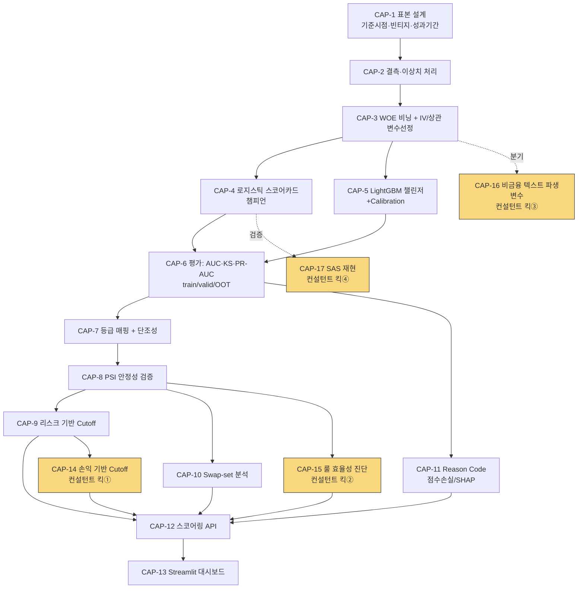

# pipeline-diagram.md — 모형 개발 파이프라인

```mermaid
flowchart TD
    A[CAP-1 표본 설계<br/>기준시점·빈티지·성과기간] --> B[CAP-2 결측·이상치 처리]
    B --> C[CAP-3 WOE 비닝 + IV/상관 변수선정]
    C --> D[CAP-4 로지스틱 스코어카드<br/>챔피언]
    C --> E[CAP-5 LightGBM 챌린저<br/>+Calibration]
    D --> F[CAP-6 평가: AUC·KS·PR-AUC<br/>train/valid/OOT]
    E --> F
    F --> G[CAP-7 등급 매핑 + 단조성]
    G --> H[CAP-8 PSI 안정성 검증]
    H --> I[CAP-9 리스크 기반 Cutoff]
    H --> J[CAP-10 Swap-set 분석]
    F --> K[CAP-11 Reason Code<br/>점수손실/SHAP]
    I --> L[CAP-12 스코어링 API]
    J --> L
    K --> L
    L --> M[CAP-13 Streamlit 대시보드]

    I --> N[CAP-14 손익 기반 Cutoff<br/>컨설턴트 킥①]
    H --> O[CAP-15 룰 효율성 진단<br/>컨설턴트 킥②]
    C -.분기.-> P[CAP-16 비금융 텍스트 파생변수<br/>컨설턴트 킥③]
    D -.검증.-> Q[CAP-17 SAS 재현<br/>컨설턴트 킥④]

    N --> L
    O --> L

    style N fill:#f9d77e,stroke:#333
    style O fill:#f9d77e,stroke:#333
    style P fill:#f9d77e,stroke:#333
    style Q fill:#f9d77e,stroke:#333
```

노란색 노드(CAP-14~17)가 v1.2에서 추가된 컨설턴트 킥 4종 — 리스크 지표를 손익·룰·비금융데이터·SAS 언어로 번역하는 확장 모듈. 핵심 파이프라인(CAP-1~13)과 병렬로 붙되, CAP-12 스코어링 API로 수렴한다.
